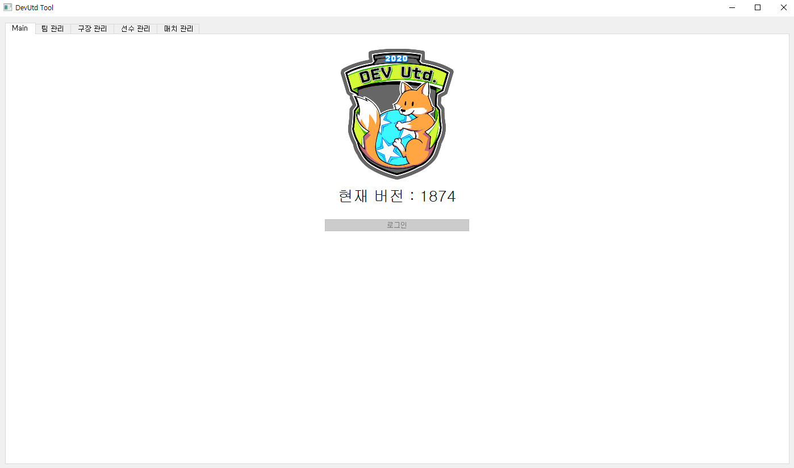
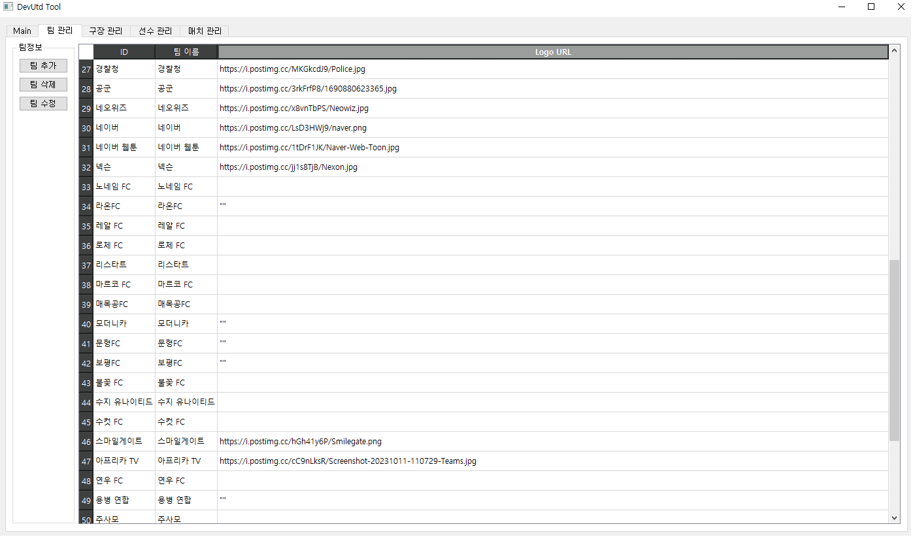
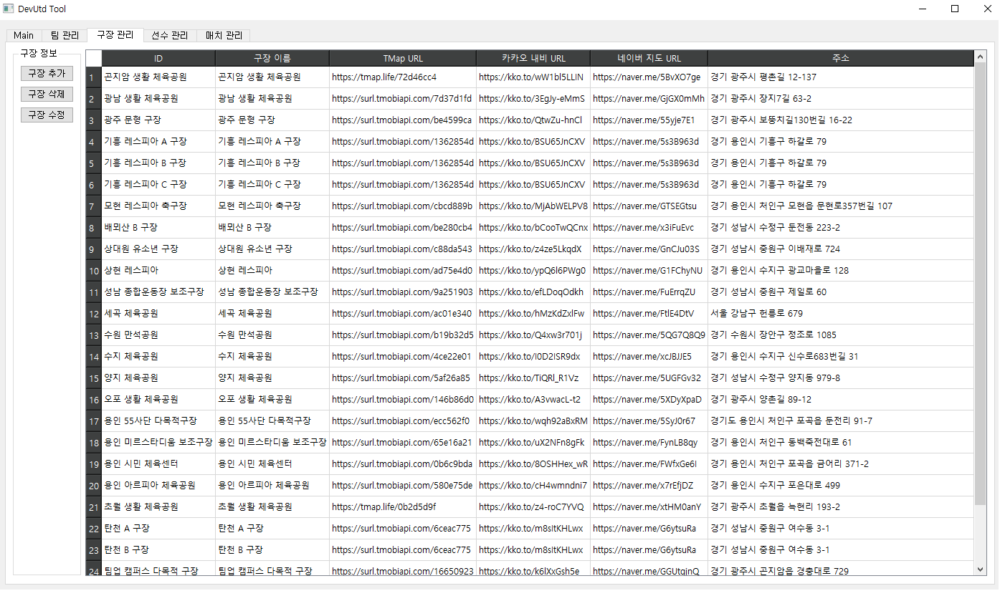
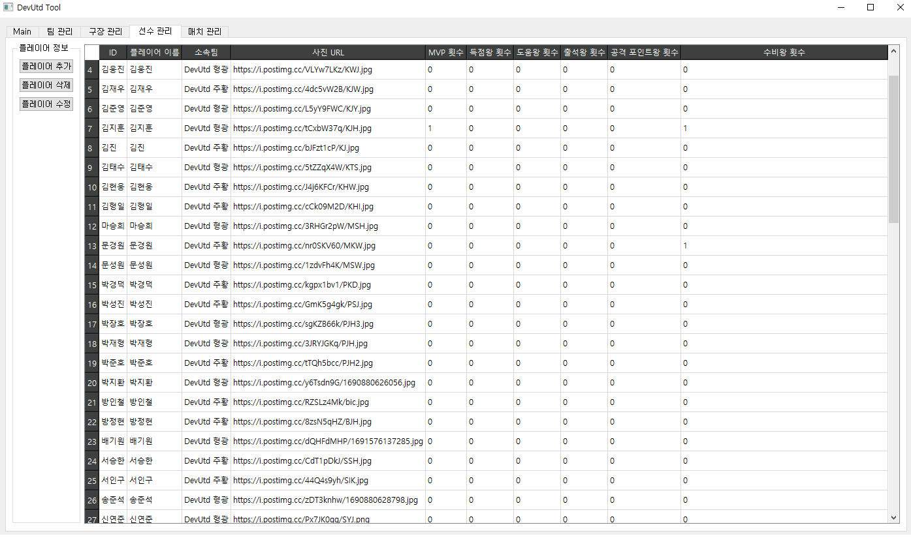
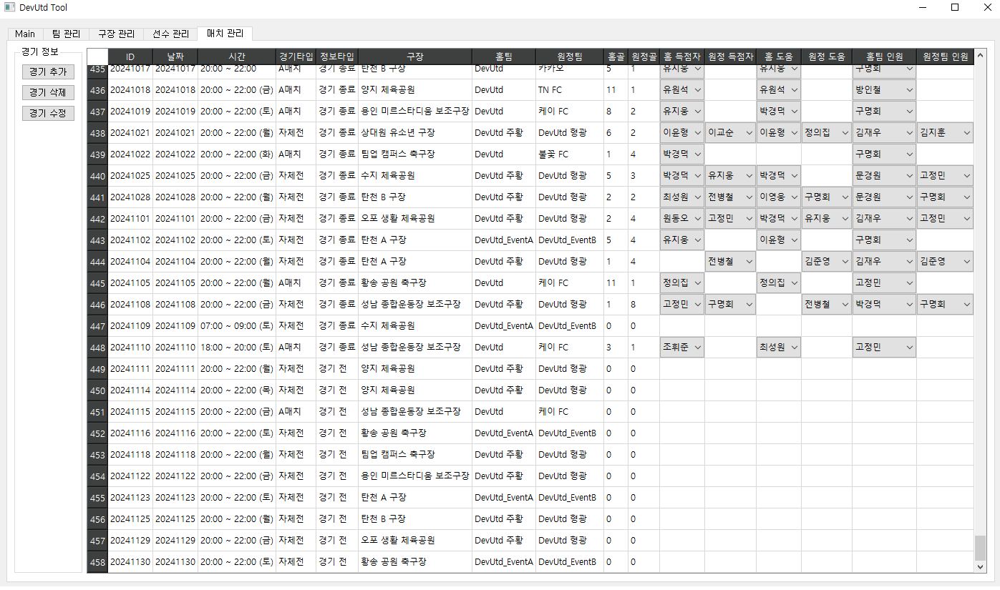
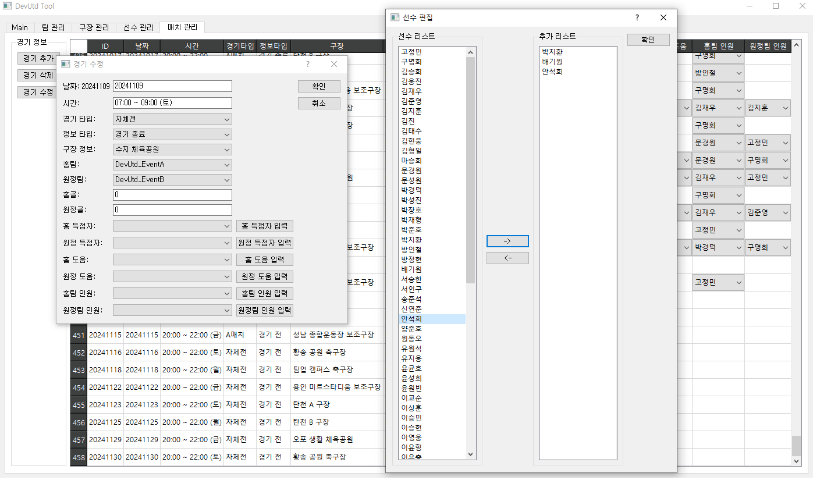

# DevUtd_Tool

2020년 창단한 아마추어 축구팀 데브 유나이티드 FC의 공식 어플을 관리하기 위한 운영툴.

## 🖥️ 프로젝트 소개
데브 유나이티드 FC 어플 데이터 관리를 저 혼자하고 있었는데 다른 팀원과 함께 관리를 하기 위하여 개발한 운영툴입니다.
 

## 🕰️ 개발 기간
* 22년 1월 ~ 22년 2월
* 개발 이후 필요할때마다 업데이트 중

## ⚙️ 개발 환경
- `python`
- `pycharm`
- `Firebase`

## 📌 주요 기능
#### 팀 관리
- 팀 정보를 관리하는 기능
- 

#### 구장 관리
- 구장들의 정보를 관리하는 기능
- 
  
#### 선수 관리
-팀의 선수들의 정보를 관리하는 기능
- 

#### 매치 관리
- 진행된 매치나 앞으로의 일정들을 관리하는 기능
- 경기 결과나 여러 스탯들의 관리하는 기능
- 
- 
